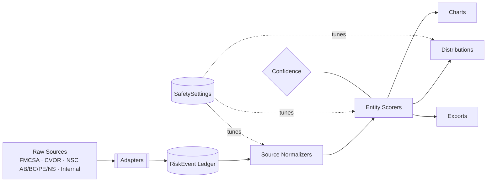
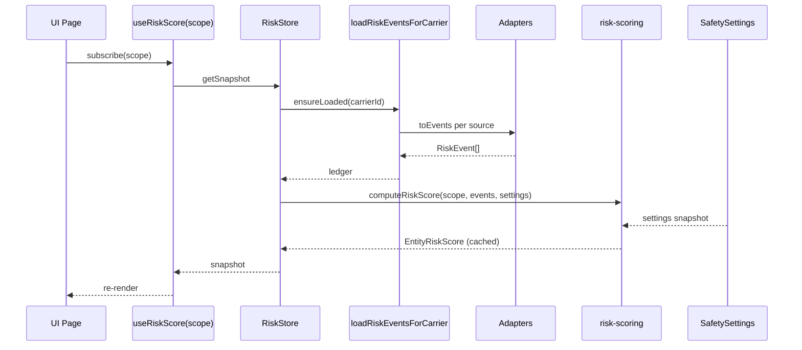
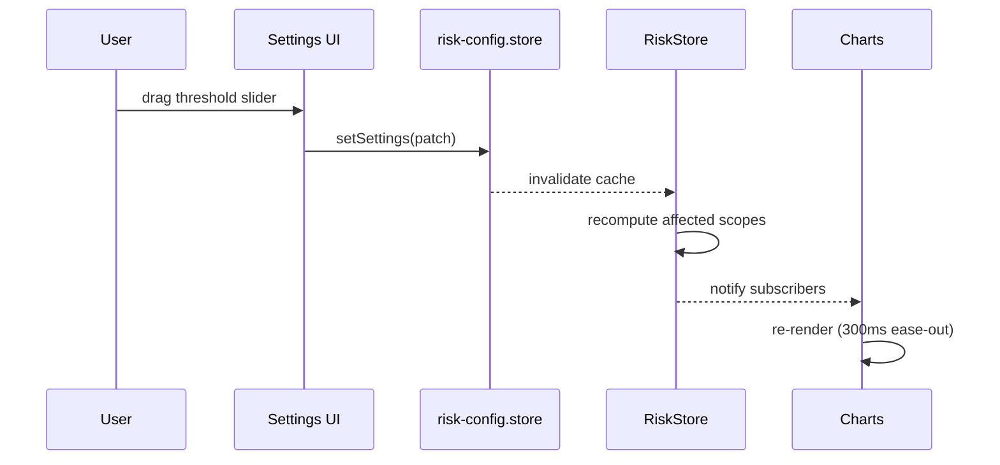

# Safety Risk Engine — Knowledge Graph

> [!abstract] Purpose
> Concept-by-concept navigable view of the [[SAFETY|master spec]]. Each section is a self-contained "node" you can link to from anywhere in the vault.

---

## Map of Content



> [!note] Key idea
> One ledger, one set of scorers, one config. Every page, chart, and export reads the same numbers — math can't drift.

---

## #️⃣ Index

- [[#Concept · Scope]]
- [[#Concept · RiskEvent]]
- [[#Concept · Source]]
- [[#Concept · Domain]]
- [[#Concept · Severity]]
- [[#Concept · Recency Decay]]
- [[#Concept · Exposure]]
- [[#Concept · Confidence]]
- [[#Concept · Source Score]]
- [[#Concept · Component Score]]
- [[#Concept · Entity Score]]
- [[#Concept · Score Band]]
- [[#Concept · Distribution]]
- [[#Concept · Top Contributor]]
- [[#Concept · Recommendation]]
- [[#Concept · Critical Override]]
- [[#Concept · Config Hash]]
- [[#Source · FMCSA SMS]]
- [[#Source · Ontario CVOR]]
- [[#Source · NSC Alberta]]
- [[#Source · NSC British Columbia]]
- [[#Source · NSC Prince Edward Island]]
- [[#Source · NSC Nova Scotia]]
- [[#Source · Incidents]]
- [[#Source · HOS ELD]]
- [[#Source · VEDR Telematics]]
- [[#Source · Maintenance and Work Orders]]
- [[#Source · Training and Documents]]
- [[#Scope · Carrier]]
- [[#Scope · Driver]]
- [[#Scope · Asset]]
- [[#Scope · Driver Asset]]
- [[#Scope · Carrier Driver]]
- [[#Scope · Carrier Asset]]
- [[#Scope · Carrier Driver Asset]]
- [[#UI · RiskScoreGauge]]
- [[#UI · RiskInfoPopover]]
- [[#UI · ComponentBreakdownBar]]
- [[#UI · SourceSplitDonut]]
- [[#UI · JurisdictionStackedBar]]
- [[#UI · RiskTrendChart]]
- [[#UI · FleetDistributionHistogram]]
- [[#UI · DriverAssetHeatmap]]
- [[#UI · TopContributorsList]]
- [[#UI · RecommendationsCard]]
- [[#UI · RiskScopePicker]]
- [[#UI · RiskBadge]]
- [[#UI · RiskExplainTip]]
- [[#UI · ExportMenu]]
- [[#Settings · Bands and Thresholds]]
- [[#Settings · Regulatory Equivalency]]
- [[#Settings · NSC Normalization]]
- [[#Settings · Recency and Decay]]
- [[#Settings · Confidence Policy]]
- [[#Settings · Combined Entity Weights]]
- [[#Settings · Component Weights]]
- [[#Settings · Critical Overrides]]
- [[#Settings · Export Defaults]]
- [[#Export · CSV]]
- [[#Export · PDF]]
- [[#Export · Full ZIP]]
- [[#Export · Full XLSX]]

---

## Concepts

### Concept · Scope

> [!info] What it is
> The "shape" of the entity being scored. Seven shapes in total.

```ts
type RiskScope =
  | { kind: 'carrier'; carrierId }
  | { kind: 'driver';  carrierId; driverId }
  | { kind: 'asset';   carrierId; assetId }
  | { kind: 'driverAsset';        carrierId; driverId; assetId }
  | { kind: 'carrierDriver';      carrierId; driverId }
  | { kind: 'carrierAsset';       carrierId; assetId }
  | { kind: 'carrierDriverAsset'; carrierId; driverId; assetId };
```

**Used by** → all `Scope · *` pages and [[#Concept · Entity Score]]

---

### Concept · RiskEvent

> [!info] What it is
> The atomic unit of the engine. Every adapter emits these. Every score sums these.

| Field | Type | Notes |
|---|---|---|
| `id` | string | Stable per source row |
| `carrierId` | string | Required root key |
| `source` | [[#Concept · Source]] | `fmcsa` / `cvor` / `nsc:AB` / … |
| `domain` | [[#Concept · Domain]] | `crash` / `hos` / … |
| `kind` | enum | inspection / violation / collision / conviction / crash / maintenance / training / document / profile |
| `date` | YYYY-MM-DD | Used by [[#Concept · Recency Decay]] |
| `driverId?` | string | Resolved by adapter |
| `assetId?` | string | Resolved by adapter |
| `severity` | 0..10 | Normalized — see [[#Concept · Severity]] |
| `points` | number | Source-native (kept for transparency) |
| `oos` | boolean | Out-of-service flag |
| `preventable?` | boolean | For incidents |
| `confidence` | enum | high / medium / low |
| `raw` | unknown | Source payload for audit |

> [!tip] Conceptually append-only
> Adapters regenerate from raw on each run; the ledger is never mutated in place. This is what makes [[#Concept · Entity Score|scores]] deterministic.

---

### Concept · Source

The origin system of a [[#Concept · RiskEvent]].

| Source | Native unit | Normalizer |
|---|---|---|
| `fmcsa` | BASIC percentile | [[#Source · FMCSA SMS]] |
| `cvor` | Rating % | [[#Source · Ontario CVOR]] |
| `nsc:AB` | R-Factor + Stage | [[#Source · NSC Alberta]] |
| `nsc:BC` | Status + Σ scores | [[#Source · NSC British Columbia]] |
| `nsc:PE` | Points / vehicle | [[#Source · NSC Prince Edward Island]] |
| `nsc:NS` | Σ scores + Level | [[#Source · NSC Nova Scotia]] |
| `internal:*` | Severity table | [[SAFETY#5.7 Internal sources (severity tables)]] |

---

### Concept · Domain

Risk category — independent of source.

`crash · unsafeDriving · hos · vehicleMaintenance · driverFitness · controlledSubstance · hazmat · inspection · conviction · collision · assetHealth · training · documentCompliance`

> [!example] One source, many domains
> A CVOR conviction with vehicle-load offence → `domain: 'vehicleMaintenance'`, not `'conviction'`. The domain is what we score against; `kind: 'conviction'` is just the row type.

---

### Concept · Severity

Normalized event impact, `σ ∈ [0, 10]`.

```ts
σ = sourceSpecificMap(rawEvent)         // see Source · *
σ_decayed = σ × decay(daysAgo)          // [[#Concept · Recency Decay]]
σ_weighted = σ_decayed × componentWeight
```

---

### Concept · Recency Decay

```
weight(d) = 0.5 ^ (d / (halfLifeMonths × 30))
          × stepDecay(d)
```

| Age | Step factor |
|---|---|
| 0–6 mo | 1.00 |
| 6–12 mo | 0.80 |
| 12–24 mo | 0.50 |
| 24+ mo | 0.0 |

Configured in [[#Settings · Recency and Decay]].

---

### Concept · Exposure

Denominator that prevents larger fleets being unfairly penalized vs. small ones.

| Scope | Default exposure |
|---|---|
| Carrier | `max(fleetSize, driverCount)` |
| Driver | `activeDays / 365` (cap 1.0) |
| Asset | `min(odometer / 100k, 1.0)` |

If exposure is unknown → low [[#Concept · Confidence]], NOT zero.

---

### Concept · Confidence

> [!warning] Low confidence ≠ low risk
> Always render a "Low confidence" badge alongside the score; downgrade [[#Concept · Recommendation|recommendations]] to "verify" rather than "act."

| Scope | High | Medium | Low |
|---|---|---|---|
| Carrier | ≥1 reg source AND (≥5 inspections OR ≥12 mo) | ≥1 source, sparse | No reg + <3 events |
| Driver | ≥3 events OR ≥90 days | 1–2 events | 0 events |
| Asset | ≥3 inspections OR reg+odo | 1–2 events | 0 events |
| Combined | both high AND ≥1 shared | otherwise | one low |

---

### Concept · Source Score

Per-source 0–100 safety value. Computed by source normalizers.

`S_FMCSA, S_CVOR, S_NSC_AB, S_NSC_BC, S_NSC_PE, S_NSC_NS`

Aggregated by [[#Settings · Regulatory Equivalency|regulatory weights]] into the `Regulatory` component of the carrier formula.

---

### Concept · Component Score

A weighted slice of an [[#Concept · Entity Score]] formula.

| Entity | Components |
|---|---|
| Carrier | Regulatory · Incidents · InspectionsOOS · DriverAggregate · AssetAggregate |
| Driver | DriverEvents · HOS · Telematics · Roadside · Incidents · Training |
| Asset | StatusAge · Maintenance · InspectionsOOS · Violations · Incidents |

Visualized via [[#UI · ComponentBreakdownBar]].

---

### Concept · Entity Score

```ts
interface EntityRiskScore {
  scope; safetyScore; riskScore;
  rating; confidence;
  sourceScores; componentScores; perJurisdiction;
  topContributors; recommendations;
  generatedAt; configHash;
}
```

Output shape is **identical for all seven scopes** — UI only varies in *which charts* it embeds.

---

### Concept · Score Band

Default mapping:

| Band | Safety | Color |
|---|---|---|
| Excellent | 85–100 | `emerald-500` |
| Good | 70–84 | `lime-500` |
| Fair | 55–69 | `amber-500` |
| Poor | 35–54 | `orange-500` |
| Critical | 0–34 | `rose-600` |

Edit in [[#Settings · Bands and Thresholds]].

---

### Concept · Distribution

Histogram of scores across a population (drivers / assets / pairs / sources / jurisdictions).

```ts
{ buckets: [{ band, count, pct }], total, median, p10, p90 }
```

Used by [[#UI · FleetDistributionHistogram]].

---

### Concept · Top Contributor

A single event that explains a meaningful slice of a score. Ordered, max 10. Surfaced in [[#UI · RiskInfoPopover]] and [[#UI · TopContributorsList]].

```ts
{ event, weighted, pctOfScore, narrative }
```

---

### Concept · Recommendation

Action card derived from the top contributor pattern.

```ts
{ severity: 'info'|'warn'|'urgent';
  title; description;
  actionKey: 'open-work-order' | 'schedule-training' | …;
  deepLink: string }
```

Rendered by [[#UI · RecommendationsCard]].

---

### Concept · Critical Override

> [!danger] Forces `Critical` band regardless of weighted score
> - Fatal crash within last 24 mo
> - Two+ OOS in 6 mo on same asset
> - BASIC alert: Crash Indicator
> - NSC BC Unsatisfactory rating
>
> Each is a toggle in [[#Settings · Critical Overrides]].

---

### Concept · Config Hash

SHA-1 of the canonical JSON of `SafetySettings`. Stamped on every export — re-running with the same hash + same data must produce an identical artifact (auditable).

---

## Sources

### Source · FMCSA SMS

> [!example] Native units
> BASIC percentiles, alerts, `smsPoints`, OOS flags, crash indicator percentiles.

**Adapters** → `fmcsaInspectionAdapter`, `fmcsaProfileAdapter`
**Normalizer** → `S_FMCSA = mean(100 - p across enrolled BASICs)`
**Severity rule** → `σ = clamp(smsPoints + (oos?4:0), 0, 10)`; alert floor `σ ≥ 7`
**Files** → `inspectionsData.ts`, `carrier-safety-data.ts → fmcsa`
**Cross-ref** → [[SAFETY#5.1 FMCSA SMS]]

---

### Source · Ontario CVOR

> [!example] Native units
> Carrier rating %, collision/conviction/inspection percentages, intervention events with OOS, points.

**Adapters** → `cvorProfileAdapter`, `cvorInterventionAdapter`
**Normalizer** → `S_CVOR = clamp(100 - rating, 0, 100)`
**Severity rules**
- Collision charged Y w/ points → `σ = clamp(4 + p×0.5, 0, 10)`
- Conviction with points → `σ = clamp(2 + p, 0, 10)`
- Inspection OOS → `σ = 10`
**Files** → `carrier-safety-data.ts → cvor`, `cvorInterventionEvents.data.ts`
**Cross-ref** → [[SAFETY#5.2 CVOR]]

---

### Source · NSC Alberta

```
abRisk =
  NotMonitored: 10
  Stage1: 17
  Stage2: 33
  Stage3: 50
  Stage4: 75
S_AB = clamp(100 - abRisk - rFactorSurcharge, 0, 100)
```

**Cross-ref** → [[SAFETY#5.3 NSC Alberta]]

---

### Source · NSC British Columbia

| Status | Default S_BC |
|---|---|
| Satisfactory | 85 |
| Conditional | 65 |
| Unsatisfactory | 35 |
| Unrated | 80 (low conf) |

Plus per-component `min(contravention, cvsa, accident)` blended in.
**Cross-ref** → [[SAFETY#5.4 NSC British Columbia]]

---

### Source · NSC Prince Edward Island

```
totalPts = collision + conviction + inspection
ppv      = totalPts / max(1, activeVehicles)
S_PE     = 100 - clamp(ppv × multiplier, 0, 100)
```

Multiplier configurable in [[#Settings · NSC Normalization]].

---

### Source · NSC Nova Scotia

```
total = conviction + inspection + collision
S_NS  = total ≤ L1 ? 95 : ≤ L2 ? 75 : ≤ L3 ? 50 : 25
```

---

### Source · Incidents

| Severity rule | σ |
|---|---|
| Fatal | 10 |
| Injury | 8 |
| Tow | 5 |
| Property only | 3 |

`preventable: true` adds floor +1.

---

### Source · HOS ELD

| Violation | σ |
|---|---|
| Driving over limit | 7 |
| Log falsification | 9 |
| Form/manner minor | 2 |

---

### Source · VEDR Telematics

| Event | σ |
|---|---|
| Collision-class | 8 |
| Harsh-brake critical | 5 |
| Speed > 15 over | 4 |

---

### Source · Maintenance and Work Orders

| Condition | σ |
|---|---|
| Maintenance overdue >30d | 4 |
| Open OOS-prone (brake/tire) | 7 |
| Work order unresolved past due | 5 |

---

### Source · Training and Documents

| Condition | σ |
|---|---|
| Mandatory training expired | 6 |
| Registration expired | 8 |
| DOT card expired | 6 |

---

## Scopes

### Scope · Carrier

```
Safety = 0.45 · Regulatory
       + 0.20 · Incidents
       + 0.15 · InspectionsOOS
       + 0.10 · DriverAggregate
       + 0.10 · AssetAggregate
```

`Regulatory = weightedMean(enrolled sources)` — see [[#Settings · Regulatory Equivalency]].

> [!note] Available-only blending
> Missing enrollments don't drag the score. A FMCSA-only carrier scores Regulatory = `S_FMCSA` × 100% of bucket.

---

### Scope · Driver

```
Safety = 0.35 · DriverEvents
       + 0.20 · HOS
       + 0.15 · Telematics
       + 0.15 · RoadsideInspections
       + 0.10 · Incidents
       + 0.05 · Training
```

Source events contribute when they resolve to `driverId`.

---

### Scope · Asset

```
Safety = 0.25 · StatusAge
       + 0.25 · Maintenance
       + 0.25 · InspectionsOOS
       + 0.15 · Violations
       + 0.10 · Incidents
```

Maintenance + work orders are immediately usable today.

---

### Scope · Driver Asset

```
Pair = 0.45 · Driver + 0.35 · Asset + 0.20 · SharedHistory
```

`SharedHistory` = events where both ids match. If empty → neutral 80, low confidence.

---

### Scope · Carrier Driver

```
Pair = 0.70 · Driver + 0.20 · CarrierRegulatory + 0.10 · FleetPeer
```

`FleetPeer` = within-carrier percentile rank × 100.

---

### Scope · Carrier Asset

```
Pair = 0.70 · Asset + 0.20 · CarrierRegulatory + 0.10 · FleetPeer
```

---

### Scope · Carrier Driver Asset

```
Triple = 0.35 · Driver + 0.30 · Asset + 0.20 · CarrierReg + 0.15 · Shared
```

> [!example] Use-case
> Dispatch-time assignment risk: should this driver-vehicle pair go on this lane today?

---

## UI Components

### UI · RiskScoreGauge

| Prop | Type | Default |
|---|---|---|
| `safetyScore` | number | required |
| `confidence` | enum | required |
| `rating` | Rating | required |
| `size` | sm/md/lg | md |
| `onInfoClick` | () => void | opens [[#UI · RiskInfoPopover]] |

> [!tip] Hover behavior
> Mouseover the arc → HoverCard shows component scores + weights + formula.

---

### UI · RiskInfoPopover

The single source of "why is the score this".

- Formula in plain English
- Component contribution bar
- Top 5 contributors (event title + date + Δ pts)
- Settings used (config hash + deep-link)
- Last 3 score deltas (vs prior calc)

> [!info] Accessibility
> Esc closes, Tab cycles, focus returns to trigger on close.

---

### UI · ComponentBreakdownBar

Stacked horizontal bar of component contributions.

| Hover target | Tooltip content |
|---|---|
| Segment | Component, raw, weighted, formula slice, # events |
| Whole bar | Σ components + scope formula |

---

### UI · SourceSplitDonut

3- or 4-arc donut: FMCSA / CVOR / NSC (NSC subdivides into AB/BC/PE/NS).

Hover: source-native score + normalized score + event count + per-source note.

---

### UI · JurisdictionStackedBar

Horizontal stack across BC / AB / PE / NS / ON / US states.
Hover: # inspections, # violations, # OOS, contributing points.

---

### UI · RiskTrendChart

Rolling 12 / 24-month score line.
Hover point: that month's score, Δ vs prior, # events, top contributor.

---

### UI · FleetDistributionHistogram

Carrier-level histogram of asset/driver count per band.
Click bar → list page filtered by `?band=`.

---

### UI · DriverAssetHeatmap

Driver × Asset matrix. Cell color = pair score; empty cell = never paired.
Hover: pair score + # shared events + last shared date.
Click → drawer with full pair breakdown.

---

### UI · TopContributorsList

Ordered list, max 10. Each row:

source pill · domain icon · date · title · severity bar · weighted · `View event →`

---

### UI · RecommendationsCard

3–5 recommendations driven by top contributors. Each:

`severity · title · description · action button · deep-link`

---

### UI · RiskScopePicker

Tab strip on the Safety Analysis page. In a Combined scope, secondary chips appear to pick the entities.

---

### UI · RiskBadge

Small inline pill: `safetyScore + band + confidence`. Used in tables and cards. Click → [[#UI · RiskInfoPopover]].

---

### UI · RiskExplainTip

Shared `(i)` button / hover card. Centralizes "what / how / where data / where to change."

```tsx
<RiskExplainTip topic="driver.formula" side="right" />
```

Topic copy lives in `explainTopics.ts` (reviewable).

---

### UI · ExportMenu

Trigger button → menu with: CSV · PDF · Full ZIP · Full XLSX.
Each disables until the engine is hydrated; shows last-run timestamp.

---

## Settings (Safety)

### Settings · Bands and Thresholds

| Field | Range | Default |
|---|---|---|
| Excellent floor | 60–95 | 85 |
| Good floor | 50–84 | 70 |
| Fair floor | 30–69 | 55 |
| Poor floor | 0–54 | 35 |

Validation: monotonic. Live histogram preview.

---

### Settings · Regulatory Equivalency

| Field | Default |
|---|---|
| Source mode | `available-only` |
| FMCSA weight | 0.35 |
| CVOR weight | 0.30 |
| NSC home weight | 0.25 |
| Additional NSC weight | 0.10 |
| Multi-NSC mode | `split` |

Weights re-normalize on save.

---

### Settings · NSC Normalization

Per-jurisdiction sub-cards:

- **AB** → stage→safety map + R-Factor surcharge
- **BC** → status→safety + threshold table
- **PE** → points-per-vehicle multiplier
- **NS** → level→safety map

---

### Settings · Recency and Decay

| Field | Default |
|---|---|
| Half-life (months) | 12 |
| Hard cutoff (months) | 36 |
| Step 0–6 mo | 1.00 |
| Step 6–12 mo | 0.80 |
| Step 12–24 mo | 0.50 |

---

### Settings · Confidence Policy

| Field | Default |
|---|---|
| Min driver events for high | 3 |
| Min asset events for high | 3 |
| Min carrier months for high | 12 |
| Low-confidence neutral safety | 75 |
| Missing source policy | `ignore` |

---

### Settings · Combined Entity Weights

Editable values for the four combined formulas.

---

### Settings · Component Weights

Per-domain weights for Driver / Asset / Carrier formulas. Reset-to-defaults per row + global.

---

### Settings · Critical Overrides

Toggles for each [[#Concept · Critical Override|override rule]]. Each toggle has an `(i)` showing the exact rule text.

---

### Settings · Export Defaults

| Field | Default |
|---|---|
| CSV scopes | all |
| PDF cover branding | carrier name + logo |
| Full export format | XLSX |
| Include raw source tabs | true |
| Include methodology appendix | true |

---

## Exports

### Export · CSV

Per-grid files:

- `carrier-risk-summary.csv`
- `driver-risk-summary.csv`
- `asset-risk-summary.csv`
- `combined-driver-asset-risk.csv`
- `risk-events-ledger.csv`
- `source-normalization.csv`
- `risk-contributions.csv`

Common columns: `carrierId, scopeKind, scopeId, scopeLabel, source, sourceKey, domain, kind, date, daysAgo, driverId, assetId, plate, unit, vin, oosCount, defects, points, severity, weighted, safetyScore, riskScore, rating, confidence, topContributor`

---

### Export · PDF

`@react-pdf/renderer`. Sections:

1. Cover (carrier · scope · period · config hash)
2. Compliance enrollment summary
3. Score card (gauge + band)
4. Component bar
5. Source donut
6. Top 10 contributors
7. Jurisdiction table
8. Driver distribution
9. Asset distribution
10. Top 5 high-risk drivers
11. Top 5 high-risk assets
12. Top 5 high-risk pairs
13. Action plan
14. Methodology appendix
15. Settings snapshot

---

### Export · Full ZIP

`safety-export-<scope>-<date>.zip`:

- `risk-summary.json` — full `EntityRiskScore`
- `events.csv` — every contributing event
- `summary.pdf` — executive PDF
- `config.json` — settings snapshot ([[#Concept · Config Hash]])
- `methodology.md` — printable spec

Built with `jszip` (~30 KB gz).

---

### Export · Full XLSX

Tabs:

Summary · Settings Snapshot · Formula Equivalency · Carrier Scores · Source Scores · Driver Scores · Asset Scores · Driver+Asset Scores · Carrier+Driver Scores · Carrier+Asset Scores · Carrier+Driver+Asset Scores · Risk Events Ledger · Raw FMCSA · Raw CVOR · Raw NSC AB · Raw NSC BC · Raw NSC PE · Raw NSC NS · Recommendations

API:

```ts
exportRiskWorkbook({
  carrierId,
  includeRawSources: true,
  includeEntityTabs: true,
  includeMethodology: true,
  format: 'xlsx',
});
```

---

## Diagrams

### End-to-end data flow



### Settings change → re-render



---

## Patterns

> [!example] How to add a new source
> 1. Define the native shape in `risk-engine.types.ts`.
> 2. Write an adapter in `risk-adapters.<source>.ts` returning `RiskEvent[]`.
> 3. Add a normalizer in `risk-normalizers.ts` that produces a 0–100 source score.
> 4. Register both in `risk-load.ts`.
> 5. Add a chip color to [[#UI · SourceSplitDonut]].
> 6. Add a methodology paragraph to [[SAFETY#5 Source Normalization]].
> 7. Add unit tests + golden file.

> [!example] How to debug a surprising score
> 1. Open [[#UI · RiskInfoPopover]] on the score → inspect formula + contributors.
> 2. Compare config hash with the export — confirm same settings.
> 3. Open the underlying [[#Concept · RiskEvent|events]] from `View event →`.
> 4. Check [[#Concept · Recency Decay|decay]] math: `σ × decay × componentWeight`.
> 5. Check [[#Concept · Exposure|exposure]] denominator for the scope.

---

## Glossary

`Safety Score` `Risk Score` `Source-native score` `Domain` `Component` `Severity (σ)` `Recency decay` `Exposure` `Confidence` `Band` `Critical override` `Config hash` `Top contributor` `Recommendation` `Adapter` `Normalizer` `Ledger`

→ Definitions live in [[SAFETY#18 Glossary]].

---

## Backlinks

- [[SAFETY]] — master implementation spec
- [[SAFETY_RISK_SCORE_ENGINE_PLAN]] — original architecture plan
- [[SAFETY_COMPLIANCE_DATA_PLAN]] — compliance enrollment data
- [[Frontend_Data_Reference]] — file-by-file inventory
- [[Safety_Compliance_Upload_Data_Requirements]] — upload contract
